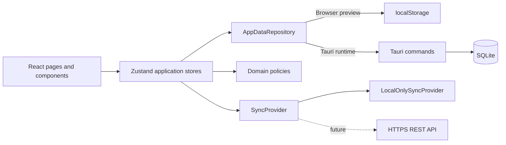
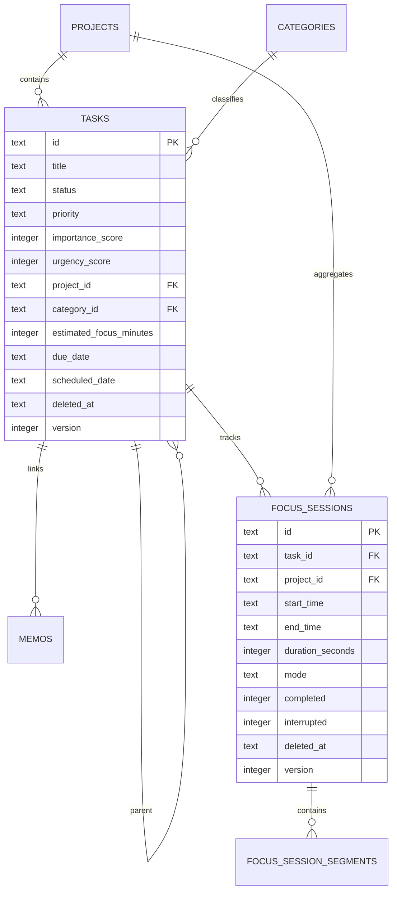

# FocusFlow 架构说明

## Product Architecture

FocusFlow 以“任务决定要做什么，专注记录证明时间投入，统计帮助调整行为，备忘录保存上下文”为主循环。所有核心能力离线可用，Focus Session 原始记录是统计的唯一事实来源，不存不可追溯的汇总结果。

应用分为四个产品层：

1. **Capture**：Task、Project、Category、Tag、Memo。
2. **Execute**：Pomodoro、Stopwatch、任务绑定、暂停片段、Focus Mode。
3. **Review**：History、日/周/月/年/自定义区间统计、项目和标签聚合。
4. **Own your data**：SQLite、迁移、JSON 迁移、CSV 分析、数据库备份、未来同步。

可调数值集中在 `AppSettings`，每项都有可工作的默认值。任务优先程度同时保留派生 `priority` 和 0-100 的重要性/紧急性原始分数，以支持四象限和九宫格之间无损切换。

## Technical Architecture



- UI 只调用 Store；组件不读取或写入 SQLite。
- Store 负责业务操作和状态变化，Repository 负责持久化边界。
- Tauri command 是 TypeScript 与 Rust 的窄接口，SQL 只存在于 Rust 层。
- 浏览器预览 Repository 与 SQLite Repository 实现同一接口，便于快速 UI 开发。
- `SyncProvider` 当前使用 no-op 的 `LocalOnlySyncProvider`；未来云同步不改变页面调用方式。
- UUID、`created_at`、`updated_at`、`deleted_at`、`version` 为未来多设备同步保留。

当前桌面持久化采用“规范列 + 完整 `payload_json`”方式：规范列支持查询和索引，JSON 保证新增客户端字段可以在早期版本平滑落盘。每次快照保存都在单个 SQLite transaction 中完成，不会留下半写入状态。后续阶段会把快照写入细化为逐实体 Repository 命令与 change log。

## Database Schema



首个 migration 还包含 `projects`、`categories`、`memos`、`settings`、`active_timer_state`。外键开启，写入使用 WAL、`synchronous=NORMAL` 与 busy timeout。已有 migration 只追加，不回写或删除用户数据。

## Directory Structure

```text
src/
  app/                 routing and application bootstrap
  components/          reusable UI, shell and charts
  features/tasks/      task-specific UI
  lib/                 i18n setup
  pages/               route-level composition
  repositories/        persistence abstraction
  services/            defaults, policies and desktop adapters
  stores/              application and timer state
  types/               domain contracts
  utils/               formatting helpers
src-tauri/
  capabilities/        minimum window permissions
  migrations/          append-only SQLite migrations
  src/                  Rust commands, database and state
  icons/                Windows, Android and iOS icon assets
```

## Android Portability

领域类型、Stores、Repository 接口、页面和大部分 UI 可以复用到 Tauri 2 Android。SQLite migration 和同步抽象也可以保留。Windows 专属能力必须放在 platform adapter 后面，包括系统托盘、开机启动、全局快捷键、窗口置顶、桌面固定、靠边吸附和 `SetThreadExecutionState`。移动端还需重新设计导航、后台计时、通知权限、生命周期与安全区；因此是共享业务核心和多数 React 代码的移植，不是直接把 Windows 安装包转换成 APK。

